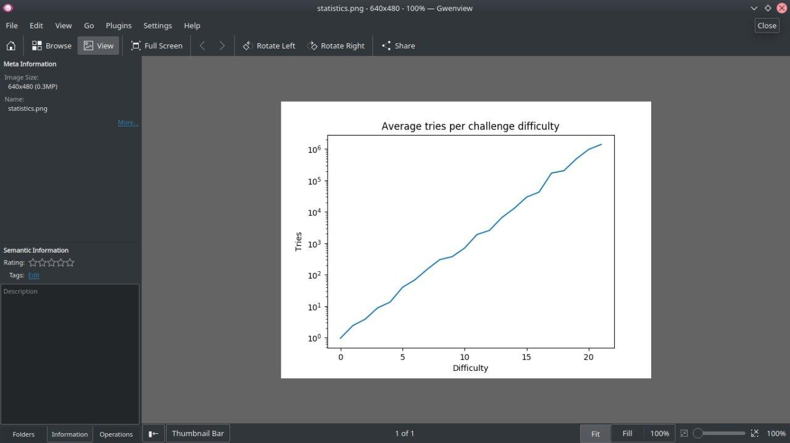

# JurisChain


Em vez de desafiar os humanos nos terminais, seria melhor desafiar os terminais. Trata-se de equilibrar a carga com os clientes para não sofrer um ataque DDoS. Inspirado pela [tecnologia blockchain](https://pt.wikipedia.org/wiki/Prova_de_trabalho).

## Sobre

É sábido que os computadores que servem os tribunais ao grande público tem sofridos diversas vezes com sobrecargas e ataques [DDoS (distributed denial of service)](https://pt.wikipedia.org/wiki/Ataque_de_nega%C3%A7%C3%A3o_de_servi%C3%A7o) que prejudicam a boa prestação da justiça no país, tirando seus portais do ar e atrapalhando magistrados, advogados, bem como as partes de processos.

Técnicas como firewalls e captchas sofisticados por outro lado não tem sido eficazes no controle do acesso público devido a natural inovação tecnológica da sociedade ([1](https://projurisbrasil.jusbrasil.com.br/artigos/189717091/saiba-o-que-sao-os-captchas-e-como-e-possivel-dribla-los-na-hora-de-fazer-um-acompanhamento-processual-mais-rapido-e-eficiente?ref=feed), [2](https://frradvogados.jusbrasil.com.br/artigos/595582536/big-data-e-acesso-a-informacao-a-legalidade-do-uso-de-bots-robos?ref=feed)). Com isso diversas empresas e cidadãos consomem esses dados sem se preocupar com a estabilidade da judicatura seja por imperícia ou desproporcionalidade.

Lembro ainda que soluções como NoCaptcha, de empresas do exterior, tem obtidos ganhos monetários com o tempo dos cidadãos, magistrados e advogados para resolver problemas de visão computacional (https://cloud.google.com/vision/, https://www.google.com/recaptcha/intro/v3.html), monitorando os usuários para venda de anúncios, e fornecendo o problema e a solução em simultâneo para controle de acesso. Os usuários dos portais jurídicos do país ensinam computadores de empresas estrangeiras e a eles liberamos acesso total e irrestrito as informações públicas de nosso país.

Pensando nisso criamos uma solução baseada em blockchain que sem o dispêndio de recursos públicos, seja no tempo dos servidores públicos ou gastos com infraestrutura e segurança, as pessoas e empresas possam acessar de forma proporcional os tribunais. A solução visa ser tão simples e mais eficaz que as estrangeiras e totalmente internalizadas, abertas, nos termos do [**Art. 14 da lei Nº 11.419**](http://www.planalto.gov.br/ccivil_03/_Ato2004-2006/2006/Lei/L11419.htm#art14):

> Art. 14. Os sistemas a serem desenvolvidos pelos órgãos do Poder Judiciário deverão usar, preferencialmente, programas com código aberto, acessíveis ininterruptamente por meio da rede mundial de computadores, priorizando-se a sua padronização.

## Segurança


A solução foi desenvolvida sobre o trabalho do [Keccak team](https://keccak.team/), vencedor da competição [NIST (Instituto Nacional de Padrões e Tecnologia dos Estados Unidos)](https://www.nist.gov/), substituindo assim os antecessores SHA-1 e SHA-2. Trata-se de um padrão mundial e foi escolhido justamente pela segurança e conformidade, não beneficiando determinado usuário em detrimento de outro. Desta forma incentivando o consumo justo das plataformas que implementarem a solução.

1. https://csrc.nist.gov/csrc/media/projects/hash-functions/documents/keccak-slides-at-nist.pdf

## Portabilidade - Uso em APIs Públicas, Aplicativos, Portais e Infraestrutura


A implementação é feita em C (linguagem de programação de baíxo nível), garantindo que todas as plataformas sejam beneficiadas com a tecnologia por causa de sua portabilidade.  O desafio pode tanto ser utilizado em APIs públicas, aplicativos ou portais impedindo sobrecarga dos serviços.

> The core C language is extremely portable. The standard Unix implementation is the GNU C compiler, which is ubiquitous not only in open-source Unixes but modern proprietary Unixes as well. GNU C has been ported to Windows and classic MacOS, but is not widely used in either environment because it lacks portable bindings to the native GUI.
> 
> The standard I/O library, mathematics routines, and internationalization support are portable across all C implementations. File I/O, signals, and process control are portable across Unixes provided one takes care to use only the modern APIs described in the Single Unix Specification; older C code often has thickets of preprocessor conditionals for portability, but those handle legacy pre-POSIX interfaces from older proprietary Unixes that are obsolete or close to it in 2003.
> 
> C portability starts to be a more serious problem near IPC, threads, and GUI interfaces. We discussed IPC and threads portability issues in Chapter 7. The real practical problem is GUI toolkits. A number of open-source GUI toolkits are universally portable across modern Unixes and to Windows and classic MacOS as well — Tk, wxWindows, GTK, and Qt are four well-known ones with source code and documentation readily discoverable by Web search. But none of them is shipped with all platforms, and (for reasons more legal than technical) none of these offers the native-GUI look and feel on all platforms. We gave some guidelines for coping in Chapter 15.
> 
> Volumes have been written on the subject of how to write portable C code. This book is not going to be one of them. Instead, we recommend a careful reading of Recommended C Style and Coding Standards [Cannon] and the chapter on portability in The Practice of Programming [Kernighan-Pike99].

[1] http://www.catb.org/~esr/writings/taoup/html/ch17s05.html

### Preparado para Web


Utilizamos o EMCC (Emscripten Compiler Frontend) para entregar um código veloz nos navegadores, fazendo com que estes sejam altamente eficientes nos desafios e a experiência do usuário seja excelente. 

## API

### Navegador Web
```html
  <link href="./style.css" rel="stylesheet" type="text/css" />
  <script>
    /* Configuração do Desafio */
    document.robotCaptcha = {
      seed: 'TrueRandomValue',
      difficulty: 10,
    };
    /* gera um evento quando resolvido */
    document.addEventListener('robotCaptcha', ({ detail: response }) => console.log(response));
  </script>
  <!-- Elemento -->
  <div id="robot-captcha"></div>
  <script src="./sha3.js"></script>
```


### C
```c
void pow_gen(pow_ctx_t *challenge, uint8_t difficulty, const void *seed, size_t inlen);

- Gera um novo challenge com um grau de complexidade e uma semente.
```
```c
int pow_verify(pow_ctx_t *challenge)

- Recebe um ponteiro com challenge e verifica se ela resolve o desafio, retornando 1 no caso de resolver ou 0 no caso de não resolver.
```
```c
int pow_try(pow_ctx_t *challenge)

- Recebe um ponteiro com challenge tenta resolver o desafio, retornando 1 no caso de resolver ou 0 no caso de não resolver.
```

## Estatísticas



Para gerar o gráfico de média de tentativas/dificuldade de desafio, faça o seguinte:

```bash
make all
virtualenv .env/
pip install -r requirements.txt
python3 genstats.py
```
Os resultados estarão no diretório `stats/`.
