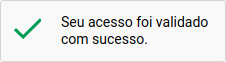

# JurisChain


Em vez de desafiar os humanos nos terminais, seria melhor desafiar os terminais. Trata-se de equilibrar a carga com os clientes para não sofrer um ataque DDoS. Inspirado pela tecnologia blockchain.

## Sobre

É sábido que os computadores que servem os tribunais ao grande público tem sofridos diversas vezes com sobrecargas e ataques DDoS (distributed denial of service) que prejudicam a boa prestação da justiça no país, tirando seus portais do ar e atrapalhando magistrados, advogados, bem como as partes de processos.

Técnicas como firewalls e captchas sofisticados por outro lado não tem sido eficazes no controle do acesso público devido a natural inovação tecnológica da sociedade. Com isso diversas empresas e cidadãos consomem esses dados sem se preocupar com a estabilidade da judicatura seja por imperícia ou desproporcionalidade.

Lembro ainda que soluções como NoCaptcha, de empresas extrangeiras, tem obtidos ganhos monetários com o tempo dos cidadãos, magistrados e advogados para resolver problemas de visão computacional (https://cloud.google.com/vision/, https://www.google.com/recaptcha/intro/v3.html), monitorando os cidadãos para venda de anúcios e fornecendo o problema e a solução em simultâneo para o controle de acesso. Os usuários dos portais jurídicos do país ensinam computadores de empresas estrangeiras e a eles liberamos acesso total e irrestrito aos dados públicos de nosso país.

Pensando nisso criamos uma solução baseada em blockchain que sem o dispêndio de recursos públicos, seja no tempo dos servidores públicos ou gastos com infraestrutura e segurança, as pessoas e empresas possam acessar de forma proporcional os tribunais. A solução visa ser tão simples e mais eficaz que as extrangeiras e totalmente internalizadas, abertas, nos termos do **Art. 14 da lei Nº 11.419**:

''' Art. 14. Os sistemas a serem desenvolvidos pelos órgãos do Poder Judiciário deverão usar, preferencialmente, programas com código aberto, acessíveis ininterruptamente por meio da rede mundial de computadores, priorizando-se a sua padronização. '''.

## API

### Navegador Web
```html
  <link href="./style.css" rel="stylesheet" type="text/css" />
  <script>
    /* Configuração do Desafio */
    document.robotCaptcha = {
      seed: 'TrueRandomValue',
      difficulty: 10,
    };
    /* gera um evento quando resolvido */
    document.addEventListener('robotCaptcha', ({ detail: response }) => console.log(response));
  </script>
  /* Elemento */
  <div id="robot-captcha"></div>
  <script src="./sha3.js"></script>
```

### C
```c
void pow_gen(pow_ctx_t *challenge, uint8_t difficulty, const void *seed, size_t inlen);

- Gera um novo challenge com um grau de complexidade e uma semente.
```
```c
int pow_verify(pow_ctx_t *challenge)

- Recebe um ponteiro com challenge e verifica se ela resolve o desafio, retornando 1 no caso de resolver ou 0 no caso de não resolver.
```
```c
int pow_try(pow_ctx_t *challenge)

- Recebe um ponteiro com challenge tenta resolver o desafio, retornando 1 no caso de resolver ou 0 no caso de não resolver.
```

## Estatísticas
Para gerar o gráfico de média de tentativas/dificuldade de desafio, faça o seguinte:

```bash
make all
virtualenv .env/
pip install -r requirements.txt
python3 genstats.py
```
Os resultados estarão no diretório `stats/`.
